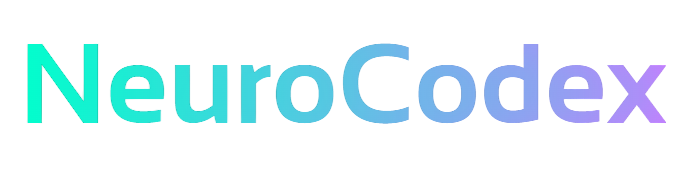

# NeuroCodex


NeuroCodex foi desenhado para interpretar "dores" específicas do cotidiano do dev apenas pesquisando palavras como "travado", "desmotivado", etc, e assim entregar "protocolos" de ação comportamental com base na mais atual neurociência cognitiva e comportamental.

É uma aplicação Front-End que usa apenas `HTML, CSS e JavaScript`, e que atua como um parceiro de _pair programming_ para a saúde mental e cognitiva do desenvolvedor.

> Curiosidade legal: ao passar o mouse encima de um protocolo, você verá o pulso elétrico de uma sinapse, simbolizando a ativação neural quando você aplica o protocolo sugerido. 🥰

**Na prática:**


## Como executar o projeto

1. Clone o repositório:

   ```bash
   git clone https://github.com/allbertuu/neurocodex.git
   ```

2. Acesse o diretório do projeto:

   ```bash
   cd neurocodex
   ```

3. Inicie o servidor de desenvolvimento - baixe a extensão [Live Server](https://marketplace.visualstudio.com/items?itemName=ritwickdey.LiveServer) se estiver usando o VSCode:

4. Abra o navegador e acesse

   ```bash
   http://127.0.0.1:5500/
   ```

5. Aproveite! 🎉

## Decisões de arquitetura

- HTML5 semântico: estrutura clara e acessível
- CSS3: estilização moderna e compatível com navegadores atuais
- JavaScript puro (Vanilla JS): linguagem da Web, leve e rápido
- Gemini API (geração da base): pela fácil integração com HTML e CSS, além de ser leve e performático

O principal aprendizado com esse projeto foi que você não precisa de um código complexo para criar uma ideia boa. **Você precisa de uma ideia boa**.

## Cores do projeto

- Fundo:  (#E2E1DD) - transmite leveza e simplicidade
- Cards:  (#2b1030) - tom profundo que sugere criatividade e mistério
- Pulso da sinapse:  (#00ffccb3) - cor vibrante que simboliza pulso elétrico

## Roadmap (próximos passos)

- [ ] Implementar sistema de favoritos
- [ ] Implementar função de "reportar protocolo" (caso haja erro semântico ou inveracidade)
- [x] Adicionar mais conteúdos (curados por mim)
- [x] Inserir favicon personalizada
- [x] Implementar animações suaves com CSS
- [x] Implementar tema escuro e fundo decorativo com tema dev
- [x] Implementar busca em tempo real (similar ao command palette do VSCode)
- [x] Implementar separação visual das categorias
- [x] Implementar responsividade para dispositivos móveis

## Leituras recomendadas

- [Sinapses](https://www.todoestudo.com.br/biologia/sinapses)

---

Desenvolvido com ❤️ por **Alberto Santos**. Confira mais sobre mim no [LinkedIn](https://www.linkedin.com/in/albertov-albuquerque/).
